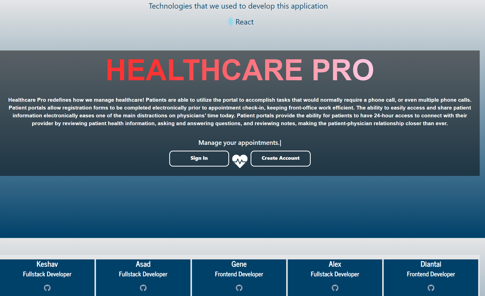
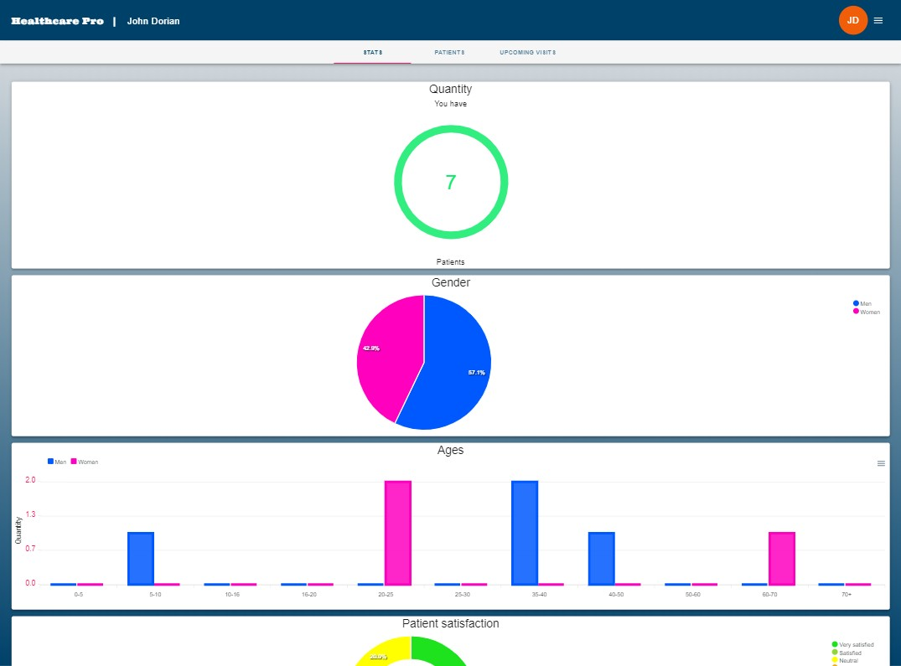
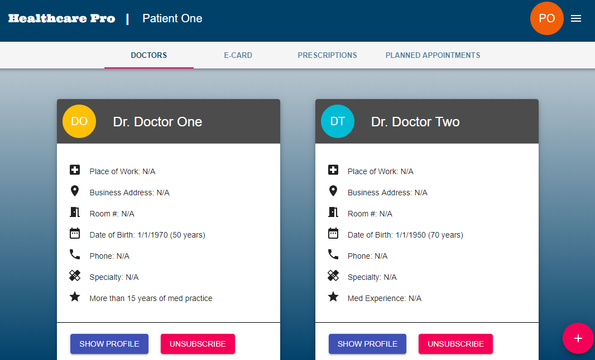
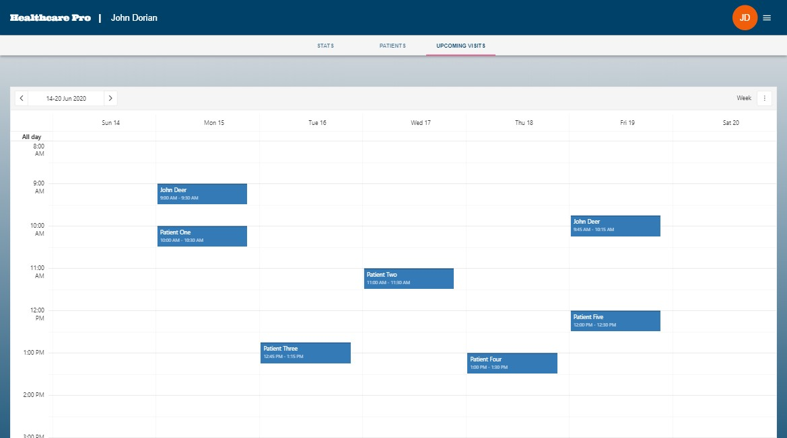
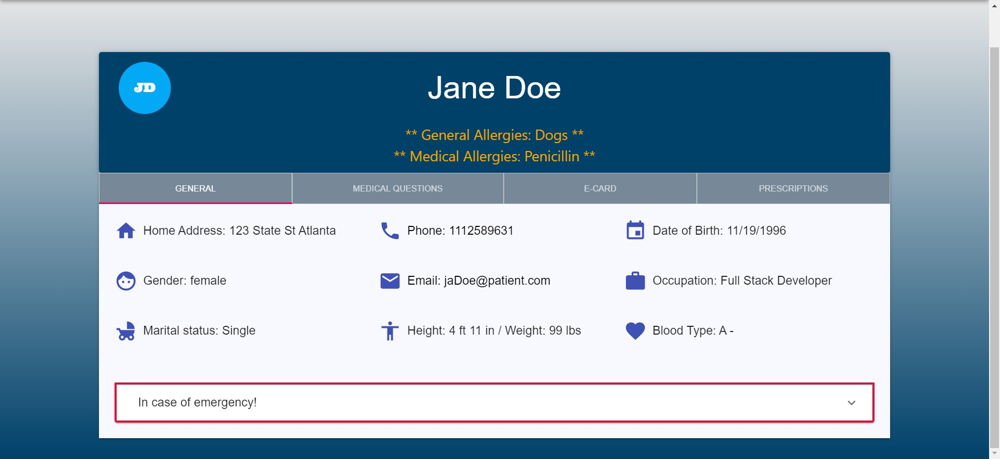

# Healthcare Pro +  

>  #Project-3 for UNC Bootcamp utilizing Node, MongoDB, Mongoose, Express, ReactJS, Redux, Material-UI and MVC design.

## Table of Contents

* [Description](#description)
* [Installation](#installation)
* [Usage](#usage)
* [Screenshots](#screenshots)
* [Built With](#built-with)
* [License](#license)
* [Contributing](#contributing)

## Description

A role-based application that helps doctors and patients with the management of healthcare. We wanted to develop an easy to use application for smaller health care providers that cannot afford the immense costs of an enterprise class EMR application that only large hospital systems can afford.  Log in as a doctor and see patient schedules for the upcoming day/week/month along with patient notes, charts, history, and the ability to order prescriptions.  Log in as as patient to schedule appointments with your doctor, see my prescriptions, and view my medical history.

 * This full-stack application is deployed on Heroku : https://project3-healthcarepro.herokuapp.com/

## Installation

 * Clone this repository from Github from the command line by typing:  
   `git clone git@github.com:gwlee244/project3.git`
  * Navigate to the 'quaranstream' folder by typing:  
  `cd project3` 
  * Install dependencies by typing:  
   `npm install`
  * Run this application by typing:   
  `npm start`
  * The application will open on localhost:3000

  ## Usage
  
  Once you have this application running on your local machine or Heroku you will be directed to the landing page. You can click the 'Create Account' button and fill out the form to create your own doctor or patient.  Alternatively, you can skip a step and click 'Sign in' and use one of our pre-made doctors or patients.    
  `Doctor:` <pre>
  <b>email:</b> jd@doctor.com <b>password:</b> doctor 
  </pre>
  `Patient:` <pre>
   <b>email:</b> jaDoe@patient.com <b>password:</b> patient
   </pre>
  Once logged in, you can see or edit your profile by clickin on the icon in the top-right corner. Use the tabs directly below the top blue header to see all the other ways you can interact between patient and doctor.
  
  ## Screenshots
* Landing Page

* Doctor Main Page

* Patient Main Page

* Schedule

* Profile

   
   ## Built With  
    &nbsp;&nbsp;&nbsp; 
  
 &nbsp;&nbsp;&nbsp;
  &nbsp;&nbsp;&nbsp; 	 
  
 &nbsp;&nbsp;&nbsp;
  
 &nbsp;&nbsp;&nbsp;
  
 &nbsp;&nbsp;&nbsp;  	   	 
  	

* **Node.js** -  JavaScript environment that executes JS code without needing a web browser
* **Express** - Web application framework that helped with routes and requests
* **MongoDB** - Flexible NoSQL database program
* **Mongoose** - Object modeling library for MongoDB
* **ORM** - *'Object Relational Mapping'* was used so that we didn't need to make sql queries
* **MVC Design** - Model View Control architecture seperates the files in the app into these 3 areas for better organization of code
* **JSON Web Tokens(JWT)** - Secure way to transmit data between parties
* **React** - One of the most powerfull, popular Javascript libraries. Used for creating interactive UI.
* **Redux** - A javascript library that maintains the state of an application
* **Material-UI** - React framework for UI design

## License 
MIT: 
---

## Contributing

* Contributing Team Members

**Asad Rauf**   
     
* Email : [umiasad2017@gmail.com](asadrauf)
* Github : [@asadrauf](https://github.com/asadrauf)

**Alex Coulter**      
    
- Email : [alexcoulter.unc@gmail.com](alexcoulter)
- Github : [@alexcoulter](https://github.com/alexcoulter)

**Diantai Johnson**   
    
- Email : [johnson.diantai@gmail.com](Alteredskull)
- Github : [@Alteredskull](https://github.com/Alteredskull)

**Keshav Avva**   
     
- Email : [keshav.s.avva@gmail.com](keshavsavva)
- Github : [@keshavsavva](https://github.com/keshavsavva)

**Gene Lee**   
 
- Email : [gwlee244@gmail.com](gwlee244)
- Github : [@gwlee244](https://github.com/gwlee244) 

Give a :star: or follow me if this project helped you.
### Any suggestions or questions are welcome!